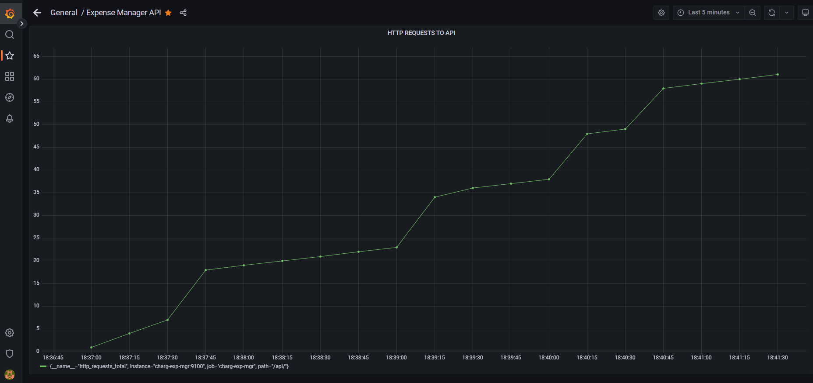

# charg-go-microservice
Expense Calculator/Organizer RESTful JSON API Microservice written in Go-lang.

The purpose of the project is to practice building a RESTful API in Go, as well as Docker/Docker Compose and Microservices.


## How-to

### Everything is setup on your Docker Server

Run 

```sh
docker compose up --build
```

Then run your http requests
Refer to [rest-api/client.http](rest-api/client.http)  file for all the functionality examples. 
Keep in mind, that client.http file is used with VS Code extension REST Client

__NOTE__ : Feel free to choose your own MySQL Parameters in [docker-compose.yaml](docker-compose.yaml) file.
### Expense Manager Functionality

1. Get All DB Entries ( ```/get``` )
2. Get Specific DB Entry by id ( ```/get/$ID``` )
3. Get All DB Entries that match the expense vendor ( ```/get/$VENDOR``` )
4. Add a new expense to the DB ( ```/add```  + json data )
5. Update existing expense in the DB by id ( ```/update/$ID``` + json data )
6. Delete a DB Entry by id ( ```/delete/$ID``` )
7. Clear the whole expenses table ( ```/clearall``` )


### Prometheus and Grafana Monitoring 

After the services are Up and Running, enter : 
```sh
localhost:3000
```

Credentials are: admin/admin (feel free to change the password or skip)

Go to *Configuration* -> DataSources to configure the Prometheus Datasource : Enter http://prometheus:9090 as the URL -> *Save and Test *

Now you can add a new dashboard and look for our metric *http_requests_total* to add to a panel. 



### Clean-up

```sh
docker compose down
```

###  Tech Stack

- Golang
- MySQL
- Gorilla Mux for request router
- Masterminds/squirrel package for MySQL cleaner MySQL queries
- Docker 
- Docker Compose
- REST API
- Unit Testing
- Prometheus & Grafana Monitoring

### Future Work
Refactor with GRPC

